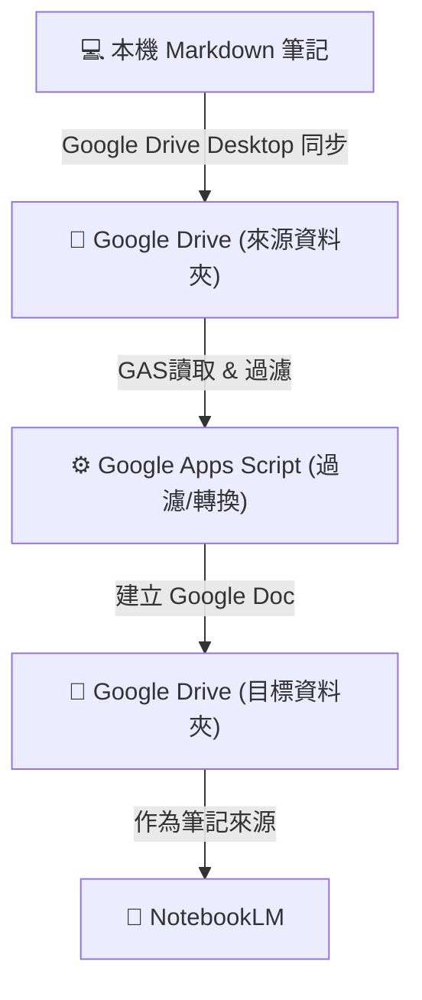

# 使用 Google Apps Script 同步 Markdown 筆記至 NotebookLM

去年 12 月接觸 NotebookLM 後，我便嘗試將筆記匯入以方便搜尋與回顧。雖然 NotebookLM 的 RAG 能力強大，也提供很多好用的功能，但在維護既有內容時，其實有些不太方便。

最大的問題在於 **重複上傳的處理機制**。即便上傳相同檔名的檔案，NotebookLM 也會將其視為全新的來源，導致舊來源與新來源並存。對於習慣持續迭代筆記的我來說，每次更新都必須先刪除舊來源再上傳，非常麻煩。目前官方似乎也沒有提供批次管理的 API，所以我也無法透過 API 進行自動化處理。

當然，如果不在意筆記內的對話紀錄，也是可以把整份筆記刪除後建立新的筆記並重新上傳。但自從我將筆記從 HackMD 遷移到 GitHub Pages 並使用資料夾分類筆記後，麻煩程度又再度上升。因為我無法一次選取所有筆記，必須逐層點進子資料夾後才能選取文章，同時還得手動排除多餘的檔案。

## NotebookLM 的同步機制與痛點

NotebookLM 目前支援從 Google Drive 同步 Google 文件 (Docs)、Google 簡報 (Slides)、PDF 和 Word (.docx) 等特定格式。當雲端檔案更新時，NotebookLM 會顯示同步提示：


美中不足的是，目前必須點進個別來源才能執行同步，無法在列表頁批次處理，但也只能將就用了。

要如何利用 NotebookLM 的 Drive 同步機制來解決我的問題呢？首先我們先回頭盤點一下目前的卡點：

1. **檔案篩選**：雖然本機可以指定資料夾和 Google Drive 進行同步，但是我的筆記因為做成 VitePress 網站，包含了許多非筆記檔案（如設定檔、圖片等）。
2. **格式支援**：我的筆記都是 Markdown (`.md`) 檔案，但 Google Drive 的 NotebookLM 同步功能並不支援直接讀取 `.md`。
3. **目錄結構困境**：筆記有包含分類資料夾，導致必須分批次選取上傳，操作繁瑣。

為了解決這些問題，我需要一個「中轉服務」。在和 Gemini 討論後，它提到了 **Google Apps Script (GAS)** 這個工具。

解決思路如下：



## Google Apps Script 實作

### 1. 建立專案

前往 [script.google.com](https://script.google.com/) 點擊「新專案」，可以看到以下介面：


簡單說明一下介面區塊（如上圖）：

- **紅框區**：
  - **檔案**：管理 `.gs` (程式碼) 與 `.html` 檔案。
  - **資料庫**：其實就是 Libraries，我也不懂為何翻成這樣，總之就是引用外部 Library 的地方。
  - **服務**：用來串接 Google 進階 API，本篇用不到。
- **藍框區**：一般的程式碼編輯器。圖中 `syncCloudyWingLog` 是函式清單，可在此選擇並執行函式。

Google Apps Script 本質上就是 JavaScript 語法。只要把下方兩個區塊的程式碼貼進去，再做以下微調即可使用。

### 2. 設定專案參數 (Configuration)

將以下程式碼貼入 `程式碼.gs`。你需要修改以下變數：

- `TargetFolderId`：存放轉換後 Google Docs 的目標資料夾 ID (可從該資料夾 URL 取得)。
- `SourceFolderId`：來源 Markdown 資料夾 ID。
  - 由於 Google Drive Desktop 是同步到「電腦」區段，無法直接像一般 Drive 資料夾樣從 URL 抓到 ID，可以使用下方的 `findCorrectFolderId()` 輔助函式，將 `targetFolderName` 改為你的同步資料夾名稱，執行後從 Log 取得正確 ID。
- 如果將這兩段程式碼放在同一個專案中，請將 `SyncUtils.startSyncEngine(...)` 改為 `startSyncEngine(...)`。

第一個區塊的其實只有 `syncCloudyWingLog()` 是執行函式，另兩個只是臨時工具。

```javascript
function syncCloudyWingLog() {
  const sourceFolderId = 'Source Folder Id';
  const targetFolderId = 'Target Folder Id';

  // 設定檔案白名單 (只同步 .md)
  const whitelistFiles = [
    /\.md$/i
  ];
  // 設定檔案黑名單
  const blacklistFiles = [
    /^index\.md$/i,
    /^about\.md$/i,
    /^tags\.md$/i
  ];

  const whitelistFolders = [];
  const blacklistFolders = [];

  // 如果是在同一個專案直接呼叫，請移除前面的 SyncUtils.
  SyncUtils.startSyncEngine(
    sourceFolderId, 
    targetFolderId, 
    whitelistFiles, 
    blacklistFiles, 
    whitelistFolders, 
    blacklistFolders
  );
}

// 輔助函式：用來找由 Google Drive Desktop 同步的資料夾 ID
function findCorrectFolderId() {
  const targetFolderName = 'docs';
  
  const folders = DriveApp.getFoldersByName(targetFolderName);
  
  Logger.log('正在搜尋名稱為 "' + targetFolderName + '" 的資料夾...');
  
  let found = false;
  
  while (folders.hasNext()) {
    const folder = folders.next();
    found = true;
    
    // 取得上一層資料夾 (父資料夾) 的名稱，用來判斷位置
    const parents = folder.getParents();
    let parentName = '無 (可能是根目錄或特殊區域)';
    if (parents.hasNext()) {
      parentName = parents.next().getName();
    }
    
    Logger.log('------------------------------------------------');
    Logger.log('📁 資料夾名稱: ' + folder.getName());
    Logger.log('🆔 ID (請複製這個): ' + folder.getId());
    Logger.log('🏠 位於 (父資料夾): ' + parentName);
    Logger.log('🔗 URL: ' + folder.getUrl());
  }
  
  if (!found) {
    Logger.log('❌ 找不到任何名為 "' + targetFolderName + '" 的資料夾。請確認名稱大小寫是否正確。');
  }
}

// 輔助函式：用來清理測試時產生的幽靈檔案
function killGhostFile() {
  var ghostId = '1Fd6GQzsZBvgmSeV23AP1PxKSQnL10aXDeRY98btPb60';
  
  try {
    var file = DriveApp.getFileById(ghostId);
    console.log('👻 抓到了！幽靈檔案名稱：' + file.getName());
    console.log('📂 所在位置：' + (file.getParents().hasNext() ? file.getParents().next().getName() : "無 (孤兒檔案)"));
    console.log('🗑️ 是否在垃圾桶：' + file.isTrashed());
    
    file.setTrashed(true);
    console.log('✅ 已成功將幽靈檔案丟入垃圾桶！');
    
  } catch (e) {
    console.log('❌ 找不到此 ID，可能已經真的消失了。錯誤：' + e.message);
  }
}

```

::: tip
當首次執行專案中的任何函式（例如 `findCorrectFolderId` 或 `syncCloudyWingLog`）時，Google 會跳出「需要授權」的視窗。

這是因為腳本需要掃描您的 Google Drive 資料夾、讀取 Markdown 檔案內容以及建立 Google Docs 文件。請點擊「核對權限」並選擇您的 Google 帳號，若出現「Google 尚未驗證應用程式」的警示畫面，請點擊「進階」並選擇「前往...... (不安全)」即可完成授權。這是自己寫的腳本，請放心使用。
:::

### 3. 核心同步邏輯 (Core Logic)

這部分處理檔案遞迴掃描、Markdown 讀取、以及 Google Doc 的建立與更新。

```javascript
/**
 * 啟動同步引擎
 * @param {string} sourceId - 來源資料夾 ID
 * @param {string} targetId - 目標資料夾 ID
 * @param {Array<RegExp>} fileWhite - 檔案白名單
 * @param {Array<RegExp>} fileBlack - 檔案黑名單
 * @param {Array<RegExp>} folderWhite - 資料夾白名單
 * @param {Array<RegExp>} folderBlack - 資料夾黑名單
 */
function startSyncEngine(sourceId, targetId, fileWhite, fileBlack, folderWhite, folderBlack) {
  const sourceFolder = DriveApp.getFolderById(sourceId);
  const targetFolder = DriveApp.getFolderById(targetId);
  
  console.log('🚀 開始同步... (模式：Markdown -> Google Doc + 分批寫入)');
  processFolderFlattened(sourceFolder, targetFolder, "", fileWhite, fileBlack, folderWhite, folderBlack);
}

/**
 * 遞迴處理資料夾並將結構扁平化
 * @param {Folder} currentSource
 * @param {Folder} rootTarget
 * @param {string} prefix
 * @param {Array<RegExp>} fileWhite
 * @param {Array<RegExp>} fileBlack
 * @param {Array<RegExp>} folderWhite
 * @param {Array<RegExp>} folderBlack
 */
function processFolderFlattened(currentSource, rootTarget, prefix, fileWhite, fileBlack, folderWhite, folderBlack) {
  const files = currentSource.getFiles();
  while (files.hasNext()) {
    const file = files.next();
    const originalName = file.getName();
    
    if (isAllowed(originalName, fileWhite, fileBlack)) {
      let baseName = (prefix ? prefix + "_" : "") + originalName;
      const targetDocName = baseName.replace(/\.md$/i, "");
      
      try {
        syncFileToGoogleDoc(file, rootTarget, targetDocName);
      } catch (e) {
        console.error("❌ 處理檔案失敗 [" + targetDocName + "]: " + e.toString());
      }
      
      // 防止 API Rate Limiting
      Utilities.sleep(150); 
    }
  }

  const subFolders = currentSource.getFolders();
  while (subFolders.hasNext()) {
    const subFolder = subFolders.next();
    const subName = subFolder.getName();

    if (isAllowed(subName, folderWhite, folderBlack)) {
      const nextPrefix = (prefix ? prefix + "_" : "") + subName;
      processFolderFlattened(subFolder, rootTarget, nextPrefix, fileWhite, fileBlack, folderWhite, folderBlack);
    }
  }
}

/**
 * 將單一檔案同步至 Google Doc (含重試機制)
 * @param {File} sourceFile
 * @param {Folder} targetFolder
 * @param {string} targetDocName
 */
function syncFileToGoogleDoc(sourceFile, targetFolder, targetDocName) {
  const maxRetries = 3; 
  let attempt = 0;
  let success = false;

  while (attempt < maxRetries && !success) {
    try {
      attempt++;
      
      const existingFiles = targetFolder.getFilesByName(targetDocName);
      let targetDocFile = null;

      while (existingFiles.hasNext()) {
        const f = existingFiles.next();
        if (f.getMimeType() === MimeType.GOOGLE_DOCS) {
          targetDocFile = f;
          break;
        }
      }

      if (targetDocFile) {
        if (sourceFile.getLastUpdated() > targetDocFile.getLastUpdated()) {
          console.log('   🔄 [更新] ' + targetDocName + (attempt > 1 ? ` (Retry ${attempt})` : ""));
          updateDocContent(targetDocFile.getId(), sourceFile);
        }
      } else {
        console.log('   ➕ [新增] ' + targetDocName + (attempt > 1 ? ` (Retry ${attempt})` : ""));
        createDocContent(targetFolder, targetDocName, sourceFile);
      }
      
      success = true; 

    } catch (e) {
      if (attempt < maxRetries) {
        console.warn(`⚠️ 失敗，等待重試 (${attempt}/${maxRetries}): ${targetDocName}`);
        Utilities.sleep(attempt * 3000); 
      } else {
        throw new Error(`重試 ${maxRetries} 次後仍失敗: ` + e.message);
      }
    }
  }
}

/**
 * 分批寫入長文字內容 (Chunking Strategy)
 * @param {Body} docBody
 * @param {string} fullText
 */
function writeContentInChunks(docBody, fullText) {
  const CHUNK_SIZE = 20000; 
  
  // 初始化：清空並建立一個初始的空段落
  docBody.setText(""); 
  
  if (!fullText || fullText.length === 0) {
    return;
  }

  for (let i = 0; i < fullText.length; i += CHUNK_SIZE) {
    const chunk = fullText.substring(i, i + CHUNK_SIZE);
    
    // 必須抓取當前最後一個段落物件，才能對它執行 appendText
    const paragraphs = docBody.getParagraphs();
    const lastParagraph = paragraphs[paragraphs.length - 1];
    
    if (lastParagraph) {
      lastParagraph.appendText(chunk);
    } else {
      // 理論上 setText("") 後一定會有一個段落，此為防呆
      docBody.appendParagraph(chunk);
    }
    
    Utilities.sleep(150); 
  }
}

/**
 * 更新現有 Google Doc 內容
 * @param {string} docId
 * @param {File} sourceFile
 */
function updateDocContent(docId, sourceFile) {
  const content = sourceFile.getBlob().getDataAsString();
  const doc = DocumentApp.openById(docId);
  const body = doc.getBody();
  
  // 必須保留 File ID 不變，僅原地更新內容，確保 NotebookLM 的引用與對話紀錄不中斷
  writeContentInChunks(body, content);
  
  doc.saveAndClose();
}

/**
 * 建立新的 Google Doc 並寫入內容
 * @param {Folder} targetFolder
 * @param {string} docName
 * @param {File} sourceFile
 */
function createDocContent(targetFolder, docName, sourceFile) {
  const content = sourceFile.getBlob().getDataAsString();
  const doc = DocumentApp.create(docName);
  const body = doc.getBody();
  
  writeContentInChunks(body, content);
  
  doc.saveAndClose();
  
  const docFile = DriveApp.getFileById(doc.getId());
  docFile.moveTo(targetFolder);
}

/**
 * 檢查名稱是否符合黑白名單規則
 * @param {string} name
 * @param {Array<RegExp>} whitelist
 * @param {Array<RegExp>} blacklist
 * @returns {boolean}
 */
function isAllowed(name, whitelist, blacklist) {
  if (blacklist && blacklist.some(pattern => pattern.test(name))) return false;
  if (!whitelist || whitelist.length === 0) return true;
  return whitelist.some(pattern => pattern.test(name));
}
```

### 4. 部署專案 (Deployment)

如果你有多份筆記需要同步，身為一個稍微有點經驗的工程師，當然不會在每個專案都複製貼上所有程式碼。這邊會將「核心同步邏輯 (`SyncUtils`)」獨立成一個專案來維護，其他專案透過引用的方式呼叫即可。後面只要其他專案配合需求調整黑白名單後呼叫 `startSyncEngine()` 就好。

1. 在核心邏輯專案中，點擊右上角「部署」 -> 「新增部署」。
2. 類型選擇 **「資料庫」**。
  
3. 輸入說明後，按部署按鈕，後面出現一個畫面有「部署作業 ID」，但這是給網站用的我們用不到。
4. 我們需要的是下圖的「指令碼 ID」，將它複製後，回到原來的專案裡。
  
5. 在左側的「資料庫」點擊 `+` 貼上剛剛複製的 ID。
  

設定小技巧：

- **版本**：這下拉選單會看到 1 和 最新程式碼快照。
  - 引用 Git 的概念來說，就是當我們每次儲存資料庫專案時，就會自動產生一個 Commit，而「最新程式碼快照」就是對照到這個最新的 Commit；每次部署則會建立一個類似版本 Tag 的標記，所以版本 1 就對應第一版的 Tag。
  - 「最新程式碼快照」適用於開發階段：當資料庫專案還在調整、不確定穩定性，且不想每次測試都重新部署發佈版本時，引用端可以選擇此快照版本。待功能確認無誤後，再正式發佈版本。
- **ID**：這是你在程式碼中呼叫此資料庫時所使用的**變數名稱** (Identifier)。
  - **重要性**：你的程式碼 `SyncUtils.startSyncEngine(...)` 中的 `SyncUtils` 就是對應到這裡的設定。如果這裡改了，程式碼也必須跟著改，否則會找不到物件無法執行。
  - **解耦的好處**：這裡的 ID 預設會帶入資料庫專案的名稱，但兩者其實是脫鉤的。這意味著，即便你未來將遠端的資料庫專案改名為 `SyncUtils_v2_Backup`，只要在這邊將 ID 維持設定為 `SyncUtils`，原本的程式碼就完全不用修改，依然能正常運作。

### 5. 設定自動化觸發 (Trigger)

最後，設定自動化排程，讓同步工作在背景自動執行。

點擊左側的鬧鐘圖示 (觸發條件)：


新增觸發條件，功能選擇 `syncCloudyWingLog` (或你的主函式)，活動來源選擇「時間驅動」，頻率依需求設定 (例如每小時)。


說實話，這套流程也僅是「勉強堪用」，但這是我現階段能想到極限的處理方式。剩下的只能期望 Google 哪天大發慈悲優化 NotebookLM 的檔案管理介面了。

## 其他的失敗嘗試

正文至此結束。以下僅記錄技術選型過程中的一些嘗試。

在決定回到 NotebookLM 之前，我也嘗試過自行架設本地 AI 知識庫，但實際操作後發現沒想像中簡單。

### AI Server 選擇

#### LM Studio

- **優點**：UI 非常友善，適合新手或純粹想體驗模型的人。介面上可以直接搜尋並下載 HuggingFace 平台上的模型。
- **放棄原因**：推測是因為 UI 介面較完善或是基於 Electron 開發的緣故，資源佔用較高；加上我始終找不到開機自動執行的設定，因此決定放棄。

::: tip
一般我們下載模型都會去 [HuggingFace](https://huggingface.co/) 平台，上面除了官方發佈的模型外，還會有很多基於官方模型調整後的版本。這些調整可能是針對審查處理的 **Abliterated** (移除拒絕機制)、**Uncensored** (未審查)，或是針對特定用途微調的版本。

- **Uncensored (未審查)**：通常是在訓練時就沒有使用對齊 (Alignment) 資料，可能會產生不恰當的回應。
- **Abliterated (移除拒絕)**：這是開源社群常用的術語，指在訓練完成的模型上，透過修改模型權重（例如移除負責拒絕請求的向量）來「遺忘」其拒絕機制，使其能回答敏感問題。一般越獄建議使用這個。
:::

#### Ollama

- **優點**：資源消耗低，支援開機自啟與自動分配 VRAM，適合需長期掛機或串接 API 的進階使用者。
- **缺點**：依賴 CLI 指令操作，對不習慣終端機的使用者較不友善。不過大部分 Server 也只有設定時會操作，大多數時間都只是掛著，所以頂多就是要調整時，需要查一下指令設定。

::: tip
我之前對 Ollama 有個錯誤認知，以為它只能下載 Ollama 平台的模型，如果要用其他模型，要去載模型的 GGUF 檔案並使用 ModelFile 匯入。
但實際上約在 2024 年 10 月 16 號左右就有提供支援 HuggingFace 下載（原來這麼久以前就有支援了...），詳情可以參考 [You can now run directly with Ollama](https://www.reddit.com/r/LocalLLaMA/comments/1g4zvi5/you_can_now_run_any_of_the_45k_gguf_on_the/) 和 [Use Ollama with any GGUF Model on Hugging Face Hub](https://huggingface.co/docs/hub/ollama)。
:::

### KoboldCpp

- **優點**：單一執行檔 (Portable) 免安裝；Context Shifting 處理極佳（適合長文/上下文切換）。
- **缺點**：需手動調整參數，上手門檻略高。

我後來因為別的需求需要比較強的上下文功能，所以選擇它。

### 知識平台

#### Open Web UI

我一開始用 Docker 架設，玩了半小時後就刪除了。功能很強大，但是我覺得它比較適合公司的知識平台，可以建帳號、群組管控，但我用不到那麼多功能。

#### AnythingLLM

可以設定多帳號模式，也可以單人使用，支援 AI Agent，以功能面向來說，它更符合我想要的需求。

可是在使用時，我才發現我對於它們運作機制的認知有誤。我原本以為把資料路徑選擇我的筆記資料夾就可以搜尋，但實際上運作機制並非如此。它會需要有一個「匯入」的行為來將筆記建立成向量索引 (Vector Indexing)，這件事就延伸出以下幾個問題：

- **匯入緩慢**：預設的匯入執行需要一點時間。後來是改下載 `bge-m3` 模型進行切換才解決。
- **參數敏感**：匯入時會有兩個參數設定 `Chunk Size` 和 `Chunk Overlap`，這會影響到它怎麼處理匯入的資料，試出最適合我的設定要花一些時間，且每次變更設定，筆記就要重新匯入一次。如果設定沒調好會造成什麼情況呢？
最簡單的對比，我的筆記有兩篇分別是 `常用套件整理 - Visual Studio` 和 `常用套件整理 - Visual Studio Code`。在 NotebookLM 我請它幫我搜尋 Visual Studio 的常用套件，它會列出正確的清單給我；但在 AnythingLLM 即便我已經說我要 Visual Studio 常用套件，但不要 Visual Studio Code，查出來的依然是 Visual Studio Code 的內容，還常常內容不完整或是混入其他低相關的筆記。

::: tip
在將筆記匯入向量資料庫時，系統無法一次處理整篇文章，必須切分成小塊 (Chunks)。

- **Chunk Size**：每個區塊的大小。設太大可能包含無關資訊（雜訊），設太小則可能切斷語義。
- **Chunk Overlap**：區塊間的重疊部分。用來確保切分點附近的上下文能被保留，避免語句在中間被切斷導致語意不全。

這兩者需要根據筆記的平均長度與類型（程式碼或一般文字）反覆調校，才能達到最佳搜尋效果。
:::

**除了「找資料」的設定很麻煩之外，「回答問題」的大腦也很重要。**

即使資料找對了，如果後端串接的 AI 模型能力不足，回答的效果也會大打折扣。

舉例來說，我覺得 Gemini Flash 回答問題常會讓我火大，**具備推理能力的模型 (如 Gemini Flash Thinking)** 就好很多，所以本機模型曾經一度嘗試 `DeepSeek-R1-Distill-Qwen-14B`，然後我就看到筆記尋文時，它每次都要先花了一些時間**進行邏輯推演 (Chain of Thought)**，然後才回答，頓時覺得 Flash 還是有其存在意義的，比 **推理模型 (Reasoning Models)** 更適合這場合。

另外，如果想自訂 Prompt 又沒有明確指示模型去參考提供的上下文 (Context)，導致模型忽略了系統暗中拼接的資料，轉而使用自己的訓練知識回答。

不過這不代表 Open Web UI 和 AnythingLLM 不好用。只是前者對我而言功能過剩；後者因我的筆記本身無隱私顧慮，若為了滿足需求得花費大量時間調教或研究外掛，成本實在太高。再加上若要針對不同服務掛載不同模型，我的 VRAM 也不足以支撐。權衡之下，我寧可把時間花在其他 AI 工具上，因此最終還是選擇回到了 NotebookLM。

## 作者後記：關於一次未存檔的慘案

由於之前使用 Antigravity，即使我有檔案尚未存檔，它也能讀取到，所以就沒特別注意到存檔這件事。

這次我完成草稿後，請 Antigravity 協助校稿並更新檔案標題。我看到出現了新頁籤，就順手關閉了舊檔案的頁籤。悲劇就此發生。Antigravity 讀取到的是我尚未存檔的內容（大約只有全文的 1/3），並基於這殘缺的內容進行了「優化」，導致產出的文章邏輯不全。原本請它還原到最初有存檔的版本，它也表示沒辦法。

最終，我只能從歷史紀錄撿回那 1/3 的內容，再把剩下的 2/3 重寫一遍，前後大概花了快 3 個小時。

這件事主要還是我的操作疏失，只能說是使用習慣真的太飄了，連最基本的備份防範都沒做好。

寫到這裡已是凌晨 3:30，快完成時鍵盤突然失靈，重開機後換網路斷線……看來是老天在催我睡覺了 orz

## 異動歷程

- 2026-01-27 初版文件建立。
