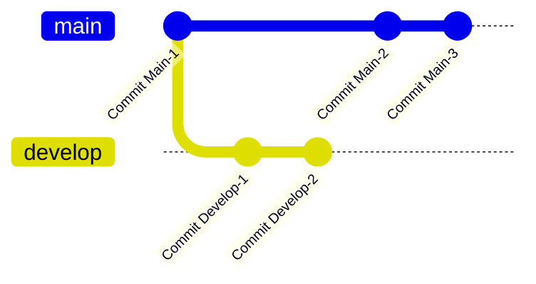
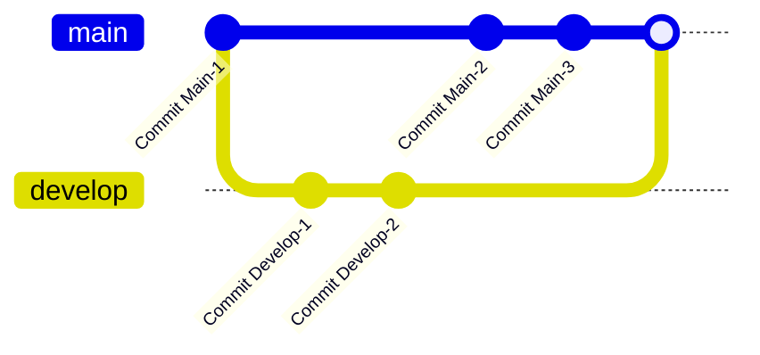
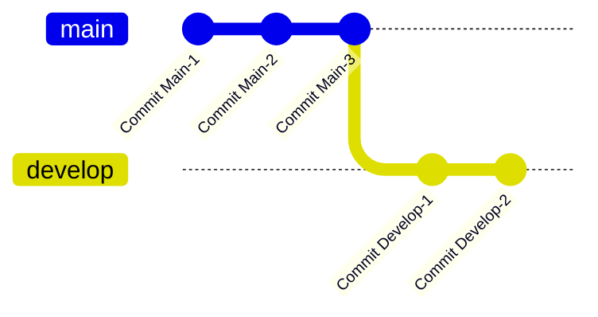

# 淺談 Git 的 Merge 和 Rebase 的差異

寫這篇只是前段時間有同事和我分享，Markdown 語法有支援 Mermaid 的語法，可以用它畫一些流程圖，因為 Git 的分支圖算是比較簡單的，所以我就參考文件「[Gitgraph Diagrams](https://mermaid.js.org/syntax/gitgraph.html)」來寫這篇筆記來玩看看。

## 合併分支的兩種方式

在 Git 中，合併分支有兩種常見的做法：`git merge` 和 `git rebase`。

* `git merge`：是將一個分支的變更合併到另一個分支中，並且保留兩個分支的歷程。這樣做會產生一個新的合併 Commit，可以明確記錄兩個分支何時合併。
  * 優點：
    * 保留完整的歷程記錄，包括每次合併的時間點。
    * 在異質性分支間合併時，可以更清楚地看到每次變更是如何整合進來的。
    * 只需判斷與目標分支最新的 Commit 是否發生衝突。因此，最多只需要解決一次衝突。
  * 缺點：
    * 如果頻繁合併，可能會使歷程記錄變得複雜和難以閱讀。
    * 每次合併都會產生新的合併 Commit，可能會導致 Commit 歷程中充滿多個不必要的 Commit。
* `git rebase`：是將一個分支上的 Commit 移動到另一個分支的頂端。這樣做會改寫歷程，讓 Commit 看起來像是直接從目標分支開始的。
  * 優點：
    * 整理 Commit 歷程，使其看起來更簡潔和線性。
  * 缺點：
    * 改寫歷程的行為可能導致失去合併點的記錄，進而難以追蹤何時進行了合併。
    * 如果有多人合作開發，可能會造成 Commit 歷程的混亂，並導致衝突難以解決。不過正常不會在共用分支上隨意使用 `git rebase`。
    * 在將當前分支的每個 Commit 移動到基底分支時，每個 Commit 都會判斷是否發生衝突。因此，在 `git rebase` 過程中可能需要多次解決衝突。

### 分支圖示例

以下是 `git merge` 和 `git rebase` 操作後產生的分支圖。

原本的分支歷程：

Merge 的結果：

Rebase 的結果：

## 使用時機

在使用 `git merge` 和 `git rebase` 時，有一個常見的判斷標準是分支的同質性或異質性。

* 同質性分支：

    同質性分支指的是兩個分支具有相同的目標，通常是指同一個分支在遠端與本地的不同版本，例如 `origin/main` 和 `main`。在這種情況下，使用 `git rebase` 更為適合。

* 異質性分支：

    異質性分支則指的是兩個具有不同目標的分支，例如 `main` 和 `develop`。在這種情況下，通常會選擇使用 `git merge`。

    可能有人會覺得奇怪，遠端分支和本地分支的同步操作通常是透過 `git pull` 和 `git push` 來進行的，與 `git merge` 似乎無關。但實際上，`git pull` 本質上是執行了一次 `git fetch`，將遠端分支的 Commit 同步到本機的臨時分支，再執行 `git merge` 將這些變更合併到本地分支。

    而 `git pull` 可以加上 `--rebase` 參數，如 `git pull --rebase`，這樣在同步遠端變更後，會用 `git rebase` 取代 `git merge`，將本地的更改整合到遠端變更之上。

另一個適合使用 `git rebase` 的情境是當團隊要求在發送 MR（Merge Request，GitLab 中的稱呼，在 GitHub 中稱為 Pull Request）之前，應確保分支不會發生衝突。此時，發 MR 的人可以先使用 `git rebase` 將當前分支的 Commit 移到目標分支的最新狀態上，解決所有衝突後再發送 MR。

::: info
有關解決衝突的權責應該是在審核者還是 MR 提交者，不同團隊作法不同，請依各團隊規定。
:::

此外，還有一種 `git rebase` 的進階用法，叫 `git rebase -interactive {起始 Commit}`，可以用來合併、變更 Commit 順序、或更改 Commit 訊息。不過超出了本文的討論範圍，因此在此不做詳述。

::: warning
除了 `git pull --rebase` 以外，Rebase 相關操作應僅用於自身開發的分支上進行，請勿在共用的分支上操作。

對共用分支的 Rebase 操作應僅在尚未執行 `git push` 前執行，因為一旦 `git push` 又變更本地儲存庫的 Commit 歷程，會導致本地與遠端的歷程不一致，如果使用 `git push --force` 強制變更遠端儲存庫，則會換成其他人的本地遠端儲存庫歷程和不一致。這樣的操作不僅影響團隊協作，還可能引發爭議。
:::

## 異動歷程

* 2024-08-23 初版文件建立。
