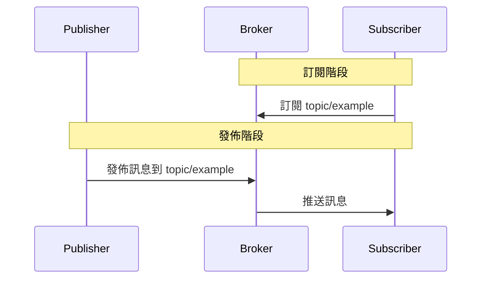
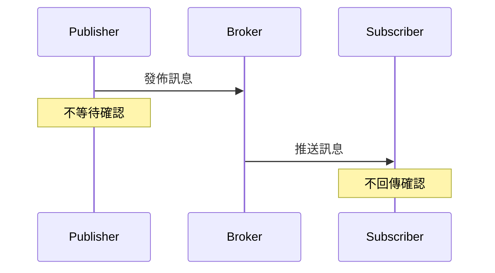
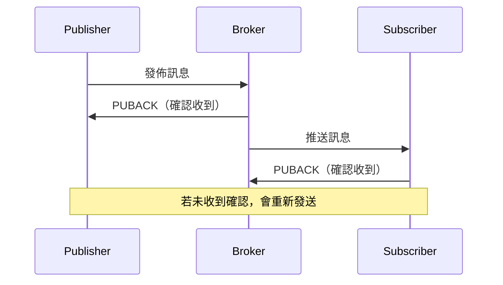
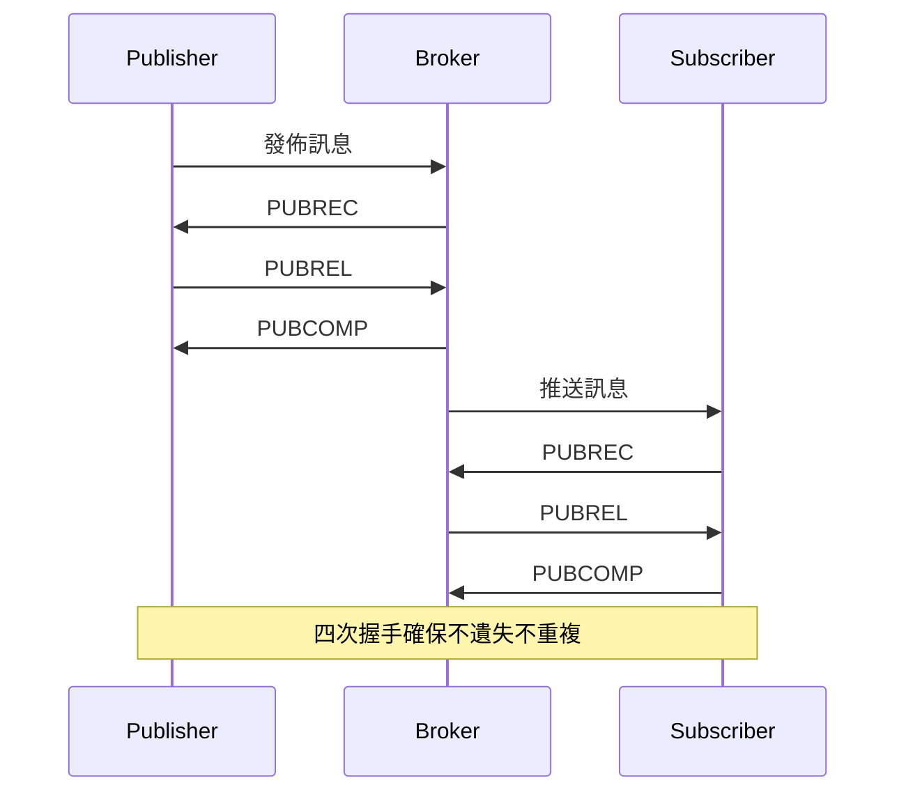

# 在 .NET 使用 MQTT：MQTTnet 與 Mosquitto 實作

本來照計畫要繼續寫 Elasticsearch 的 .NET 查詢篇，但最近跟 Claude 聊過後，覺得前兩篇那種寫法太耗心力，寫到後面又開始有點厭世，他建議可以先緩緩。剛好 104 上看到不少職缺都有提到 IoT/MQTT，就想來摸摸看。這篇主要是轉換心情用，內容不會太深入，雖然實際寫下來感覺，除了篇幅比較短之外，並沒有輕鬆多少。

至於年底那篇 Elasticsearch 的查詢篇出不出得來嘛……反正只是自己看的筆記，大概也沒人等，沒完成就沒完成。

## 前言

MQTT (Message Queuing Telemetry Transport) 是一種輕量級的發佈／訂閱式訊息傳輸協定，特別適合用於物聯網 (IoT) 裝置的通訊。由於其低頻寬消耗和簡單的協定設計，在資源受限的環境中表現優異。

## MQTT 基本概念

MQTT 採用發佈／訂閱模式，主要包含以下角色：

* **Broker（代理伺服器）**：負責接收、過濾和分發訊息給訂閱者。是整個系統的核心，所有訊息都要經過 Broker。
* **Publisher（發佈者）**：向特定主題發佈訊息的客戶端。
* **Subscriber（訂閱者）**：訂閱特定主題以接收訊息的客戶端。
* **Topic（主題）**：訊息的分類標籤，用來區分不同類型的訊息。

### 運作流程

1. **Subscriber 向 Broker 註冊訂閱**：Subscriber 告訴 Broker 自己想要接收哪些主題的訊息。
2. **Publisher 向 Broker 發佈訊息**：Publisher 將訊息發送到 Broker 的特定主題。
3. **Broker 匹配並分發訊息**：Broker 檢查哪些 Subscriber 訂閱了該主題，並將訊息推送給它們。



### Topic（主題）

Topic 是訊息的分類標籤，使用斜線 `/` 分隔的階層結構，類似檔案系統的路徑。

**範例：**

```text
home/living-room/temperature
home/living-room/humidity
home/bedroom/temperature
factory/production-line-1/machine-a/status
```

#### 主題的限制與規則

* **階層分隔符號**：使用 `/` 分隔不同層級。
* **區分大小寫**：`Home/Temperature` 和 `home/temperature` 是不同的主題。
* **長度限制**：理論上可達 65,535 個字元，但實務上建議在 100 個字元以內。
* **字元使用**：可以包含 UTF-8 字元，但建議只使用英數字、連字號 `-` 和底線 `_`。
* **禁止使用 null 字元**：不可包含 U+0000（`\0`）。
* **空白主題**：不允許使用空字串作為主題。
* **斜線位置**：開頭或結尾不應該有斜線。因為 `/home/temperature`、`home/temperature/` 和 `home/temperature` 會被視為不同的主題（斜線代表空字串層級），容易造成訂閱錯誤。

**特殊字元：**

* **`+`**：單層萬用字元（只能用於訂閱）
* **`#`**：多層萬用字元（只能用於訂閱）
* **`$`**：系統主題前綴，保留給 Broker 使用（如 `$SYS/broker/clients/connected`）

#### 系統主題（`$` 開頭）

雖然 MQTT 規範沒有明確禁止應用程式使用 `$` 開頭的主題，但業界已形成共識：`$` 開頭的主題保留給 Broker 發佈系統資訊使用，應用程式不應該使用這類主題。

**常見的系統主題：**

##### `$SYS` 主題

Broker 使用 `$SYS` 開頭的主題發佈系統統計資訊和狀態：

```text
$SYS/broker/version                    # Broker 版本
$SYS/broker/clients/connected          # 目前連線的客戶端數量
$SYS/broker/messages/received          # 接收的訊息總數
$SYS/broker/uptime                     # Broker 運行時間
```

這些主題可以用於監控 Broker 的健康狀態和效能指標。

##### `$share` 主題（MQTT 5.0）

MQTT 5.0 引入了共享訂閱（Shared Subscriptions）功能，允許多個訂閱者以負載平衡的方式接收同一主題的訊息。共享訂閱的主題格式為：

```text
$share/{ShareName}/{TopicFilter}
```

**概念說明：**

一般的訂閱模式下，所有訂閱同一主題的客戶端都會收到該主題的每一則訊息（廣播模式）。但在共享訂閱中，同一個 ShareName 群組內的訂閱者只有一個會收到訊息，Broker 會自動進行負載分配。

**範例：**

```text
# 三個訂閱者加入同一個共享群組
Subscriber A: $share/workers/task/queue
Subscriber B: $share/workers/task/queue
Subscriber C: $share/workers/task/queue

# 當有訊息發佈到 task/queue 時：
# 訊息 1 → 由 Subscriber A 接收
# 訊息 2 → 由 Subscriber B 接收
# 訊息 3 → 由 Subscriber C 接收
# 訊息 4 → 由 Subscriber A 接收（輪流分配）
```

**使用場景：**

* 工作佇列：多個 Worker 處理同一個任務佇列。
* 負載平衡：將大量訊息分散到多個處理節點。
* 水平擴展：增加訂閱者數量來提升處理能力。

**萬用字元與 `$` 主題的關係：**

萬用字元 `#` 和 `+` 不會匹配 `$` 開頭的主題：

```text
訂閱 # 不會收到 $SYS/ 開頭的訊息
訂閱 +/monitor 不會收到 $SYS/monitor 的訊息
若要訂閱系統主題，需明確指定：$SYS/#
```

#### 命名建議

* **使用階層化結構**：從大到小、從粗到細，例如：`地區/建築/樓層/房間/裝置/資料類型`。
* **保持一致性**：統一使用小寫英文，單字之間用連字號 `-` 分隔。
* **避免過深階層**：建議控制在 3-5 層，過深會難以管理。
* **語意化命名**：讓主題名稱能清楚表達用途，例如 `device/sensor-001/temperature` 比 `d/s1/t` 更易懂。

#### 萬用字元使用

Subscriber 訂閱時可以使用萬用字元來匹配多個主題：

**`+` 單層萬用字元**：匹配單一層級的任意內容。

```text
訂閱：home/+/temperature
符合：home/living-room/temperature
符合：home/bedroom/temperature
不符合：home/bedroom/sensor/temperature（多一層）
```

**`#` 多層萬用字元**：匹配當前層級及以下所有層級（必須在主題最後）。

```text
訂閱：home/living-room/#
符合：home/living-room/temperature
符合：home/living-room/light/status
符合：home/living-room/sensor/temperature/current
```

**重要**：萬用字元只能用於訂閱，不能用於發佈。Publisher 必須指定明確的主題名稱。

### QoS（服務品質等級）

MQTT 提供三種 QoS 等級，用來控制訊息傳遞的可靠性。需要注意的是，MQTT 訊息傳遞分成兩段，每段都可以指定 QoS：

1. **發佈 QoS**：Publisher 到 Broker 的傳遞可靠性。
2. **訂閱 QoS**：Broker 到 Subscriber 的傳遞可靠性上限。

**最終 Subscriber 收到的 QoS = min(發佈 QoS, 訂閱 QoS)**

```text
Publisher --[發佈 QoS]--> Broker --[訂閱 QoS]--> Subscriber
                                        |
                              實際使用較小的 QoS
```

#### QoS 等級說明

##### QoS 0：最多傳送一次（At most once）

* **特性**：發送後不管，不確認是否送達。
* **適用場景**：對即時性要求高但可容忍資料遺失的情況，例如：溫度感測器每秒更新，偶爾遺失一筆不影響整體。
* **優點**：效能最好，網路負擔最小。
* **缺點**：訊息可能遺失。



##### QoS 1：至少傳送一次（At least once）

* **特性**：發送後等待接收方確認（PUBACK：Publish Acknowledgement），如果沒收到確認會重送。
* **適用場景**：需要確保訊息送達，但可容忍重複的情況，例如：開關控制指令。
* **優點**：確保訊息送達。
* **缺點**：可能收到重複訊息（如果 PUBACK 遺失，會重送）。



##### QoS 2：確保只傳送一次（Exactly once）

* **特性**：使用四次握手機制確保訊息不遺失也不重複，握手流程包含：
  * PUBREC（Publish Received）：接收方確認已收到發佈訊息。
  * PUBREL（Publish Release）：發送方表示已準備好完成傳遞。
  * PUBCOMP（Publish Complete）：接收方確認訊息已完全處理。
* **適用場景**：對資料準確性要求極高的情況，例如：金融交易、計費系統。
* **優點**：訊息保證送達且不重複。
* **缺點**：效能最差，網路負擔最大。



#### 發佈 QoS 與訂閱 QoS 的關係

當發佈者和訂閱者設定不同的 QoS 時，實際使用的 QoS 會取兩者中較小的值：

| 發佈 QoS | 訂閱 QoS | 最終 Subscriber 收到的 QoS |
|---------|---------|--------------------------|
| 0 | 0 | 0 |
| 0 | 1 | 0 |
| 0 | 2 | 0 |
| 1 | 0 | 0 |
| 1 | 1 | 1 |
| 1 | 2 | 1 |
| 2 | 0 | 0 |
| 2 | 1 | 1 |
| 2 | 2 | 2 |

**範例說明：**

假設 Publisher 以 QoS 2 發佈一則訊息到 `sensor/temperature` 主題：

* Subscriber A 以 QoS 2 訂閱 → 收到的訊息為 QoS 2（min(2, 2) = 2）。
* Subscriber B 以 QoS 1 訂閱 → 收到的訊息為 QoS 1（min(2, 1) = 1）。
* Subscriber C 以 QoS 0 訂閱 → 收到的訊息為 QoS 0（min(2, 0) = 0）。

這樣的設計讓不同訂閱者可以根據自己的需求選擇適當的 QoS，達到靈活性和效能的平衡。

#### QoS 等級選擇建議

| 場景 | 建議 QoS | 原因 |
|------|---------|------|
| 環境感測資料（溫度、濕度） | QoS 0 | 資料頻繁更新，偶爾遺失不影響 |
| 開關控制指令 | QoS 1 | 需確保送達，可自行處理重複 |
| 重要警報通知 | QoS 1 或 2 | 必須確保送達 |
| 金融交易、計費 | QoS 2 | 絕不能遺失或重複 |

## 使用 Docker Compose 架設 Mosquitto

### 建立專案結構

建立專案資料夾結構如下：

```text
mosquitto/
│
├── docker-compose.yml
├── volumes/
│   ├── config/
│   │   ├── mosquitto.conf
│   │   └── entrypoint.sh
│   ├── data/
│   └── log/
```

### docker-compose.yml 設定

```yaml
services:
  mosquitto:
    image: eclipse-mosquitto:2
    container_name: mosquitto
    restart: always
    ports:
      - "1883:1883"     # MQTT TCP
      - "9001:9001"     # MQTT WebSocket
    volumes:
      - ./volumes/config:/mosquitto/config
      - ./volumes/data:/mosquitto/data
      - ./volumes/log:/mosquitto/log
    entrypoint: ["/mosquitto/config/entrypoint.sh"]
```

### Mosquitto 設定檔

在 `config/mosquitto.conf` 建立設定檔：

```conf
# ---------- TCP Listener ----------
# 開發環境使用 1883，正式環境建議 TLS 8883
listener 1883
protocol mqtt

# ---------- WebSocket Listener ----------
# 提供瀏覽器或前端 MQTT over WebSocket
listener 9001
protocol websockets

# ---------- 認證 ----------
# 禁止匿名連線，使用 password.txt 管理帳號
allow_anonymous false
password_file /mosquitto/config/password.txt

# ---------- 持久化 ----------
# 將訊息、Retain、QoS 1/2 session 儲存在磁碟
persistence true
persistence_location /mosquitto/data/

# ---------- 日誌 ----------
# 輸出到檔案
log_dest file /mosquitto/log/mosquitto.log
# 輸出到 stdout（容器 log）
log_dest stdout
# 記錄訊息類型
# 開發環境可用: log_type all → 記錄 debug / notice / warning / error
# 正式環境建議: log_type error warning notice → 避免 debug 訊息
log_type all

# ---------- 安全性 ----------
# 啟用 TLS 時需提供以下證書
# cafile /mosquitto/config/ca.crt
# certfile /mosquitto/config/server.crt
# keyfile /mosquitto/config/server.key
```

:::info
憑證設定部分未經實際測試，可能有其他需要注意的設定細節（如證書格式、路徑權限等）。正式環境使用前建議參考 [Mosquitto TLS 官方文件](https://mosquitto.org/man/mosquitto-conf-5.html)。
:::

### 啟動腳本

在 `config/entrypoint.sh` 建立腳本檔：

```shell
#!/bin/sh
set -e

echo "[ENTRYPOINT] Start entrypoint.sh"

# ---------- 檢查 /mosquitto/config/password.txt ----------
echo "[STEP] Checking if password.txt exists..."
if [ ! -f /mosquitto/config/password.txt ]; then
    echo "[STEP] password.txt not found, generating default user..."
    mosquitto_passwd -b -c /mosquitto/config/password.txt myuser mypassword
    echo "[STEP] Generated default user."
else
    echo "[STEP] password.txt already exists, skip generation."
fi

# ---------- 修正資料夾權限 ----------
# Mosquitto 容器內使用 UID 1883 執行
# 需要將目錄擁有者改為 1883，確保 Mosquitto 能正常讀寫
echo "[STEP] Setting ownership for config, log, data folders..."
chown -R 1883:1883 /mosquitto/config /mosquitto/log /mosquitto/data

# ---------- 啟動 Mosquitto ----------
echo "[STEP] Starting Mosquitto..."
exec mosquitto -c /mosquitto/config/mosquitto.conf
```

### 啟動 Mosquitto

在 docker-compose.yml 所在目錄執行：

```bash
# 為了確保 sh 有權限執行
chmod -R 755 ./volumes/config/entrypoint.sh

docker-compose up -d
```

查看日誌：

```bash
docker-compose logs -f mosquitto
```

應該會看到以下訊息：

```text
mosquitto  | [ENTRYPOINT] Start entrypoint.sh
mosquitto  | [STEP] Checking if password.txt exists...
mosquitto  | [STEP] password.txt not found, generating default user...
mosquitto  | [STEP] Generated default user.
mosquitto  | [STEP] Setting ownership for config, log, data folders...
mosquitto  | [STEP] Starting Mosquitto...
```

此時 config 底下會產生一個 password.txt 的檔案，裡面包含預設使用者帳號和加密後的密碼。

## .NET 使用 MQTTnet 套件

### 使用版本

* .NET 10
* MQTTnet 5.0.1.1416

### 基礎範例：發佈與訂閱

這個範例展示 MQTT 的基本操作流程，包含建立連線、訂閱主題、發佈訊息和接收訊息。

```csharp
using System.Text;
using MQTTnet;
using MQTTnet.Protocol;

string brokerAddress = "localhost";
int brokerPort = 1883;

Console.WriteLine("========================================");
Console.WriteLine("    MQTT 發佈/訂閱範例");
Console.WriteLine("========================================\n");

Console.WriteLine("【步驟 1】建立訂閱者");
Console.WriteLine("----------------------------------------");

MqttClientOptions subscriberOptions = CreateClientOptions("訂閱者");
using IMqttClient subscriberClient = await CreateClientAsync(subscriberOptions);

await SubscribeAsync(subscriberClient, "test/topic");

Console.WriteLine("\n");
await Task.Delay(500);  // 稍微等待，讓輸出更清楚

Console.WriteLine("【步驟 2】建立發佈者");
Console.WriteLine("----------------------------------------");

MqttClientOptions publisherOptions = CreateClientOptions("發佈者");
using IMqttClient publisherClient = await CreateClientAsync(publisherOptions);

Console.WriteLine("\n");
await Task.Delay(500);

Console.WriteLine("【步驟 3】發佈訊息");
Console.WriteLine("----------------------------------------");

await PublishMessageAsync(publisherClient, "test/topic", "Hello, MQTT!");
await Task.Delay(200);

await PublishMessageAsync(publisherClient, "test/topic", "這是第二則訊息");
await Task.Delay(200);

Console.WriteLine("\n");

Console.WriteLine("【步驟 4】等待訊息接收");
Console.WriteLine("----------------------------------------");
await Task.Delay(500);  // 確保訊息都被接收

Console.WriteLine("\n");
Console.WriteLine("========================================");
Console.WriteLine("按任意鍵取消訂閱並結束程式...");
Console.WriteLine("========================================");
Console.ReadKey();

Console.WriteLine("\n【步驟 5】清理資源");
Console.WriteLine("----------------------------------------");

await UnsubscribeAsync(subscriberClient, "test/topic");
await subscriberClient.DisconnectAsync();
await publisherClient.DisconnectAsync();

Console.WriteLine("程式結束");

MqttClientOptions CreateClientOptions(string clientId) {
    return new MqttClientOptionsBuilder()
        .WithTcpServer(brokerAddress, brokerPort)
        .WithCredentials("myuser", "mypassword")
        .WithClientId(clientId) // 若未設定，會以 Guid.NewGuid().ToString("N") 為 ID
        .Build();
}

async Task<IMqttClient> CreateClientAsync(MqttClientOptions options) {
    MqttClientFactory factory = new();
    IMqttClient client = factory.CreateMqttClient();
    client.ApplicationMessageReceivedAsync += OnMessageReceivedAsync;

    await client.ConnectAsync(options, CancellationToken.None);
    Console.WriteLine($"{options.ClientId} 已連線到 Broker");

    return client;
}

Task OnMessageReceivedAsync(MqttApplicationMessageReceivedEventArgs e) {
    string payload = Encoding.UTF8.GetString(e.ApplicationMessage.Payload);
    Console.WriteLine($"[{e.ClientId}] 收到訊息");
    Console.WriteLine($"   主題：{e.ApplicationMessage.Topic}");
    Console.WriteLine($"   內容：{payload}");
    return Task.CompletedTask;
}

async Task SubscribeAsync(IMqttClient client, string topic) {
    MqttClientSubscribeOptions subscribeOptions = new MqttClientSubscribeOptionsBuilder()
        .WithTopicFilter(filter => {
            filter.WithTopic(topic);
            filter.WithQualityOfServiceLevel(MqttQualityOfServiceLevel.ExactlyOnce);
        })
        .Build();

    await client.SubscribeAsync(subscribeOptions, CancellationToken.None);
    Console.WriteLine($"已訂閱主題：{topic}");
}

async Task UnsubscribeAsync(IMqttClient client, string topic) {
    MqttClientUnsubscribeOptions unsubscribeOptions = new MqttClientUnsubscribeOptionsBuilder()
        .WithTopicFilter(topic)
        .Build();

    await client.UnsubscribeAsync(unsubscribeOptions, CancellationToken.None);
    Console.WriteLine($"已取消訂閱主題：{topic}");
}

async Task PublishMessageAsync(IMqttClient client, string topic, string payload) {
    MqttApplicationMessage message = new MqttApplicationMessageBuilder()
        .WithTopic(topic)
        .WithPayload(payload)
        .WithQualityOfServiceLevel(MqttQualityOfServiceLevel.ExactlyOnce)
        .Build();

    await client.PublishAsync(message, CancellationToken.None);
    Console.WriteLine($"[{client.Options.ClientId}] 已發佈訊息");
    Console.WriteLine($"   主題：{topic}");
    Console.WriteLine($"   內容：{payload}");
}
```

執行結果：

```text
========================================
    MQTT 發佈/訂閱範例
========================================

【步驟 1】建立訂閱者
----------------------------------------
訂閱者 已連線到 Broker
已訂閱主題：test/topic


【步驟 2】建立發佈者
----------------------------------------
發佈者 已連線到 Broker


【步驟 3】發佈訊息
----------------------------------------
[發佈者] 已發佈訊息
   主題：test/topic
   內容：Hello, MQTT!
[訂閱者] 收到訊息
   主題：test/topic
   內容：Hello, MQTT!
[發佈者] 已發佈訊息
   主題：test/topic
   內容：這是第二則訊息
[訂閱者] 收到訊息
   主題：test/topic
   內容：這是第二則訊息


【步驟 4】等待訊息接收
----------------------------------------


========================================
按任意鍵取消訂閱並結束程式...
========================================

【步驟 5】清理資源
----------------------------------------
已取消訂閱主題：test/topic
程式結束
```

### 進階範例：IoT 溫度感測器模擬

這個範例模擬 IoT 場景，包含感測器定期發送資料，以及監控系統接收並處理資料。使用 CancellationToken 來優雅地停止背景任務。

```csharp
using System.Text;
using System.Text.Json;
using MQTTnet;

string brokerAddress = "localhost";
int brokerPort = 1883;

Console.WriteLine("========================================");
Console.WriteLine("       IoT 溫度感測器模擬");
Console.WriteLine("========================================\n");

// 建立發佈者（感測器）
using IMqttClient sensorClient = await CreateClientAsync("Sensor-001");

// 建立訂閱者（監控系統）
using IMqttClient monitorClient = await CreateClientAsync("Monitor-001");

// 監控系統訂閱訊息
monitorClient.ApplicationMessageReceivedAsync += e => {
    string json = Encoding.UTF8.GetString(e.ApplicationMessage.Payload);
    SensorRecord? data = JsonSerializer.Deserialize<SensorRecord>(json);

    if (data is not null) {
        Console.WriteLine("[監控系統] 收到感測器資料");
        Console.WriteLine($"   裝置 ID：{data.DeviceId}");
        Console.WriteLine($"   溫度：{data.Temperature:F1}°C");
        Console.WriteLine($"   濕度：{data.Humidity:F1}%");
        Console.WriteLine($"   時間：{data.Timestamp:yyyy-MM-dd HH:mm:ss}\n");

        // 警報檢查
        if (data.Temperature > 30D) {
            Console.ForegroundColor = ConsoleColor.Red;
            Console.WriteLine("警告：溫度過高！\n");
            Console.ResetColor();
        }
    }

    return Task.CompletedTask;
};

Console.WriteLine("正在啟動系統...");
await monitorClient.SubscribeAsync("sensor/temperature");
Console.WriteLine("系統啟動完成\n");

// 模擬感測器每 2 秒發送一次資料
Console.WriteLine("開始模擬感測器資料（按任意鍵停止）...");
Console.WriteLine("----------------------------------------\n");

Random random = new();
CancellationTokenSource cts = new();

Task sensorTask = Task.Run(async () => {
    while (!cts.Token.IsCancellationRequested) {
        // 產生模擬資料
        SensorRecord data = new(
            DeviceId: "Sensor-001",
            Temperature: 20D + random.NextDouble() * 15D,  // 20-35°C
            Humidity: 40D + random.NextDouble() * 30D,      // 40-70%
            Timestamp: DateTime.Now
        );

        string json = JsonSerializer.Serialize(data);

        MqttApplicationMessage message = new MqttApplicationMessageBuilder()
            .WithTopic("sensor/temperature")
            .WithPayload(json)
            .Build();

        await sensorClient.PublishAsync(message);
        Console.WriteLine($"[感測器] 已發送資料");

        await Task.Delay(2000, cts.Token);  // 每 2 秒一次
    }
}, cts.Token);

Console.ReadKey();
cts.Cancel();

try {
    await sensorTask;
} catch (TaskCanceledException) {
    // Task.Delay 被 CancellationToken 中斷時會拋出此例外
    // 這是預期行為，不需要額外處理
}

await sensorClient.DisconnectAsync();
await monitorClient.DisconnectAsync();

Console.WriteLine("\n系統已關閉");

async Task<IMqttClient> CreateClientAsync(string clientName) {
    MqttClientFactory factory = new();
    IMqttClient client = factory.CreateMqttClient();

    MqttClientOptions options = new MqttClientOptionsBuilder()
        .WithTcpServer(brokerAddress, brokerPort)
        .WithCredentials("myuser", "mypassword")
        .Build();

    await client.ConnectAsync(options, CancellationToken.None);
    Console.WriteLine($"{clientName} 已連線到 Broker");

    return client;
}

record SensorRecord(string DeviceId, double Temperature, double Humidity, DateTime Timestamp);
```

執行結果：

```text
========================================
       IoT 溫度感測器模擬
========================================

Sensor-001 已連線到 Broker
Monitor-001 已連線到 Broker
正在啟動系統...
系統啟動完成

開始模擬感測器資料（按任意鍵停止）...
----------------------------------------

[感測器] 已發送資料
[監控系統] 收到感測器資料
   裝置 ID：Sensor-001
   溫度：31.9°C
   濕度：43.8%
   時間：2025-11-15 23:51:22

警告：溫度過高！

[感測器] 已發送資料
[監控系統] 收到感測器資料
   裝置 ID：Sensor-001
   溫度：21.9°C
   濕度：65.7%
   時間：2025-11-15 23:51:24


系統已關閉
```

## 進階功能

### 遺囑訊息（Last Will and Testament）

當客戶端**異常斷線**時，Broker 會自動發佈遺囑訊息，通知其他客戶端該設備已離線。

正常呼叫 `DisconnectAsync()` **不會**發送遺囑訊息，只有在網路中斷、程式崩潰、未正常斷線等情況下才會觸發。

以下範例設定遺囑訊息：當 `client-001` 異常斷線時，Broker 會自動發佈 `offline` 訊息到 `status/client-001` 主題。

```csharp
MqttClientFactory factory = new();
IMqttClient client = factory.CreateMqttClient();

MqttClientOptions options = new MqttClientOptionsBuilder()
    .WithTcpServer(brokerAddress, brokerPort)
    .WithCredentials("myuser", "mypassword")
    .WithClientId("client-001")
    .WithWillTopic("status/client-001")
    .WithWillPayload("offline")
    .WithWillQualityOfServiceLevel(MqttQualityOfServiceLevel.AtLeastOnce)
    .WithWillRetain(true)
    .Build();

await client.ConnectAsync(options, CancellationToken.None);
```

**測試方式**：
可以寫個簡單的 Console 程式，比較以下兩種情況的差異：

1. 程式碼中有呼叫 `DisconnectAsync()` 再結束 → 不會發送遺囑訊息。
2. 程式碼中沒有呼叫 `DisconnectAsync()` 就結束 → 會發送遺囑訊息。

**使用場景**：

* 設備異常斷線偵測：當設備因網路中斷、程式崩潰等異常原因斷線時，自動通知監控系統。

### 保留訊息（Retained Message）

設定保留標誌後，Broker 會儲存該主題的最後一則訊息。新訂閱者連線時會立即收到最後一則保留訊息，無需等待下一次發佈。

```csharp
MqttApplicationMessage message = new MqttApplicationMessageBuilder()
    .WithTopic("sensor/temperature")
    .WithPayload("25.5")
    .WithRetainFlag(true)
    .Build();

await client.PublishAsync(message);
```

**使用場景**：

保留訊息適用於「只需要最新一筆資料」的情境，不適用於歷史紀錄或需要完整資料序列的場景，例如：

* **設備狀態**：儲存設備的最新狀態（如開／關、線上／離線）。
* **設定資訊**：儲存系統設定，新設備連線時立即獲得設定。
* **最新讀數**：儲存感測器的最新讀數。

### Clean Session（清除會話）

#### MQTT 3.1.1：Clean Session

在 MQTT 3.1.1 中，客戶端連線時可以設定 `Clean Session` 旗標：

**Clean Session = true**（預設）：

* 連線時清除之前的 Session。
* 斷線後，Broker 會刪除該客戶端的所有訂閱資訊和未傳送的訊息。
* 重新連線時需要重新訂閱，且不會收到離線期間的訊息。

**Clean Session = false**（持久會話）：

* 連線時保留之前的 Session
* 斷線後，Broker 會保留該客戶端的訂閱資訊
* 離線期間發佈到已訂閱主題的 **QoS 1 和 QoS 2** 訊息會被 Broker 保留
* 重新連線時會自動恢復訂閱，並接收離線期間累積的訊息

#### MQTT 5.0：Clean Start + Session Expiry Interval

在 MQTT 5.0 中，`Clean Session` 被拆分為兩個獨立的設定：

**Clean Start**：決定連線時是否使用現有的 Session：

* `true`：清除現有 Session，建立新的 Session。
* `false`：嘗試使用現有 Session（如果存在的話）。

**Session Expiry Interval**：設定 Session 在斷線後保留多久（單位：秒）：

* `0`：斷線後立即刪除 Session，預設值。
* `> 0`：斷線後保留指定的秒數
* 4294967295(`uint.MaxValue`)：Session 永不過期。

**MQTT 3.1.1 與 MQTT 5.0 的對應關係：**

| MQTT 3.1.1 | MQTT 5.0 等同設定 |
|-----------|-----------------|
| Clean Session = true | Clean Start = true + Session Expiry Interval = 0 |
| Clean Session = false | Clean Start = false + 未設定 Session Expiry Interval |

:::warning
根據 MQTT 5.0 規範如下：
>Setting Clean Start to 1 and a Session Expiry Interval of 0, is equivalent to setting CleanSession to 1 in the MQTT Specification Version 3.1.1. Setting Clean Start to 0 and no Session Expiry Interval, is equivalent to setting CleanSession to 0 in the MQTT Specification Version 3.1.1.

但實際上我不確定是因為 MQTTnet 將 `SessionExpiryInterval` 預設值設為 `0` 還是 Mosquitto 的實作問題，若未設定 `WithSessionExpiryInterval()` 無法保留 Session。
:::

#### MQTTnet 的實作

在 MQTTnet 中，`WithCleanSession()` 和 `WithCleanStart()` 是相同的：

```csharp
/// <summary>
///     Clean session is used in MQTT versions below 5.0.0. It is the same as setting "CleanStart".
/// </summary>
public MqttClientOptionsBuilder WithCleanSession(bool value = true) {
    _options.CleanSession = value;
    return this;
}

/// <summary>
///     Clean start is used in MQTT versions 5.0.0 and higher. It is the same as setting "CleanSession".
/// </summary>
public MqttClientOptionsBuilder WithCleanStart(bool value = true) {
    _options.CleanSession = value;
    return this;
}
```

#### 使用範例

**MQTT 3.1.1 規範（簡單）：**

```csharp
MqttClientOptions options = new MqttClientOptionsBuilder()
    .WithTcpServer(brokerAddress, brokerPort)
    .WithCredentials("myuser", "mypassword")
    .WithClientId("client-001")  // 固定的 ClientId
    .WithCleanSession(false)     // 使用持久會話
    .Build();

await client.ConnectAsync(options);

// 訂閱時使用 QoS 1 或 2
await client.SubscribeAsync(new MqttTopicFilterBuilder()
    .WithTopic("test/topic")
    .WithQualityOfServiceLevel(MqttQualityOfServiceLevel.AtLeastOnce)
    .Build());
```

**MQTT 5.0 規範（明確控制過期時間）：**

```csharp
MqttClientOptions options = new MqttClientOptionsBuilder()
    .WithTcpServer(brokerAddress, brokerPort)
    .WithCredentials("myuser", "mypassword")
    .WithClientId("client-001")         // 固定的 ClientId
    .WithCleanStart(false)              // 嘗試使用現有 Session
    .WithSessionExpiryInterval(600)     // Session 在斷線後保留 600 秒（10 分鐘），預設值為 0，所以一定要設定
    .Build();

await client.ConnectAsync(options);
```

## 參考資源

* [MQTT 官方網站](https://mosquitto.org/man/mqtt-7.html)
* [MQTT Version 5.0 規範](https://docs.oasis-open.org/mqtt/mqtt/v5.0/mqtt-v5.0.html)
* [Eclipse Mosquitto 官方文件](https://mosquitto.org/documentation/)
* [MQTTnet GitHub Repository](https://github.com/dotnet/MQTTnet)

## 異動歷程

* 2025-11-15 初版文件建立。

---

###### tags: `.NET` `DevOps` `Docker` `Mosquitto` `MQTT` `MQTTnet`